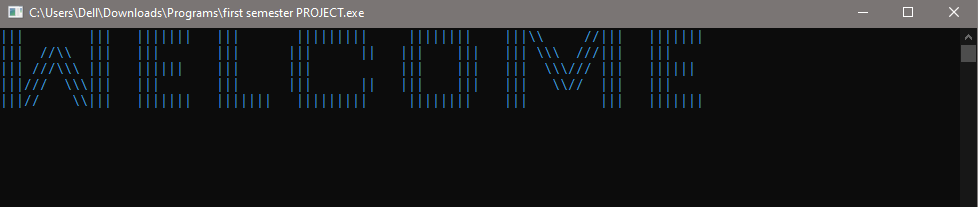
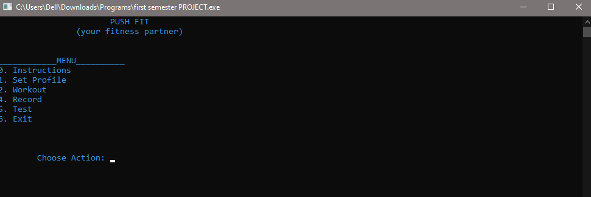
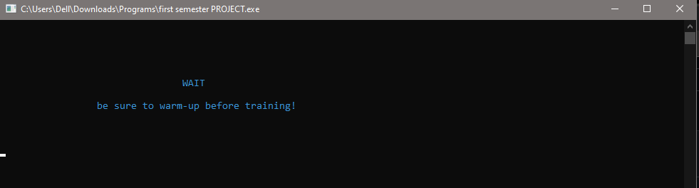
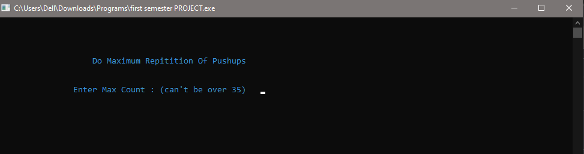
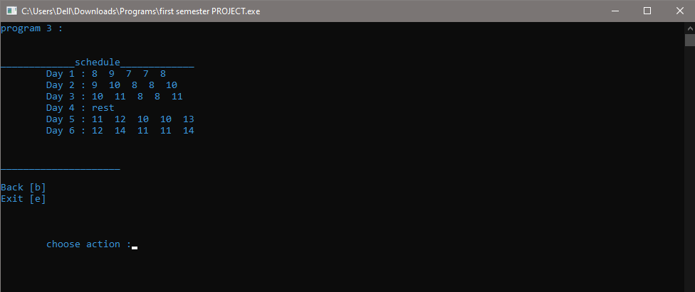

# Fitness Application - CLI



## Table of Contents
- [Introduction](#introduction)
- [Features](#features)
- [Screenshots](#screenshots)
- [Usage](#usage)
- [Requirements](#requirements)
- [Installation](#installation)
- [Contributing](#contributing)
- [Finishing Remarks](#finishing-remarks)

## Introduction

This repository contains the Fitness Application, a command-line interface (CLI) program developed as a part of my 1st-semester Programming Fundamentals course during my BCS studies in 2020. The purpose of this project was to create an interactive fitness application where users can create an account, set fitness goals, and receive personalized workout plans based on their goals and performance in a push-up test.

The application is entirely built using C++ programming language, providing an easy-to-navigate and user-friendly experience for individuals looking to improve their fitness journey.

## Features

- User account creation and management
- Setting fitness goals based on preferences (e.g., weight loss, muscle gain, general fitness)
- Customized workout plans tailored to individual goals
- Performance test for push-ups to gauge fitness level
- Easy-to-use CLI interface for a seamless user experience

## Screenshots






## Usage

To use the Fitness Application, follow these steps:

1. Clone the repository to your local machine using the following command:
```
git clone https://github.com/mbilal-x/CLI_FitnessApp.git
```

2. Navigate to the project directory.

3. Compile and run the application using a C++ compiler. OR Just run the .exe application.

5. The application will prompt you to create an account and set your fitness goals.

6. Perform the push-up test to determine your fitness level.

7. Based on your goals and test results, the application will provide a personalized workout plan.

## Requirements

To run the code of Fitness Application, you need the following:

- C++ Compiler (e.g., g++)
- Command-line interface (CLI) environment

## Installation

- Simply compile in any C++ supporting IDE.

## Contributing

I welcome contributions to this project. If you find any issues, have suggestions for improvements, or would like to add new features, feel free to open an issue or submit a pull request. Let's collaborate and make this project even better together!

---

## Finishing Remarks

Thank you for exploring this Fitness Application repository, which served as my 1st-semester project during my BCS studies in 2020. I hope this CLI tool proves useful to you in achieving your fitness goals. If you have any questions or feedback, please don't hesitate to reach out. Happy fitness journey! 💪🏋️‍♀️
